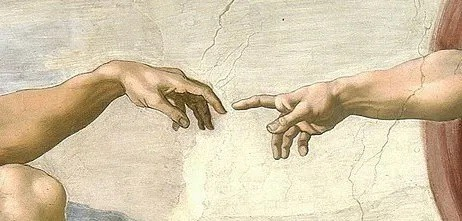
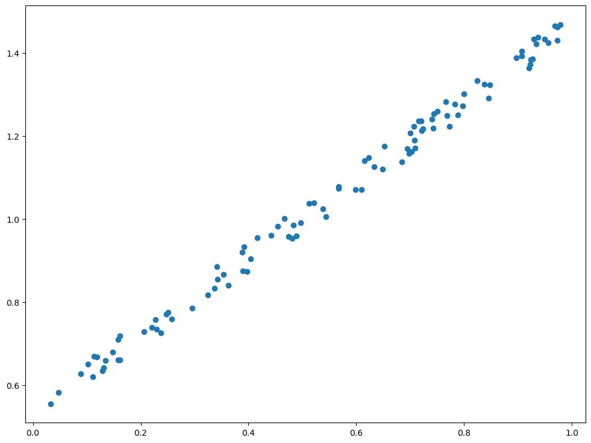
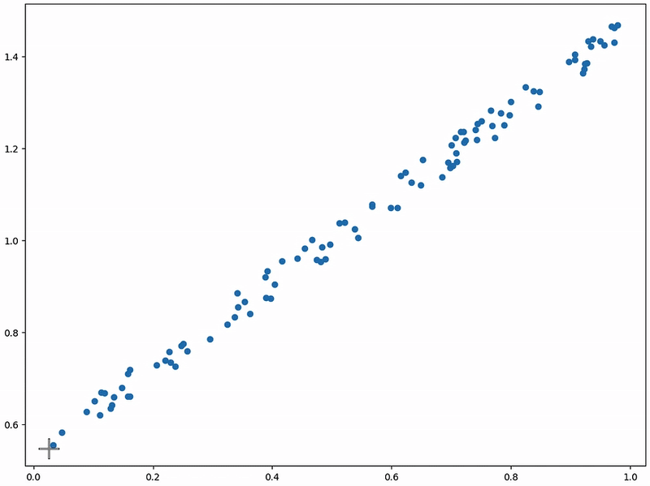
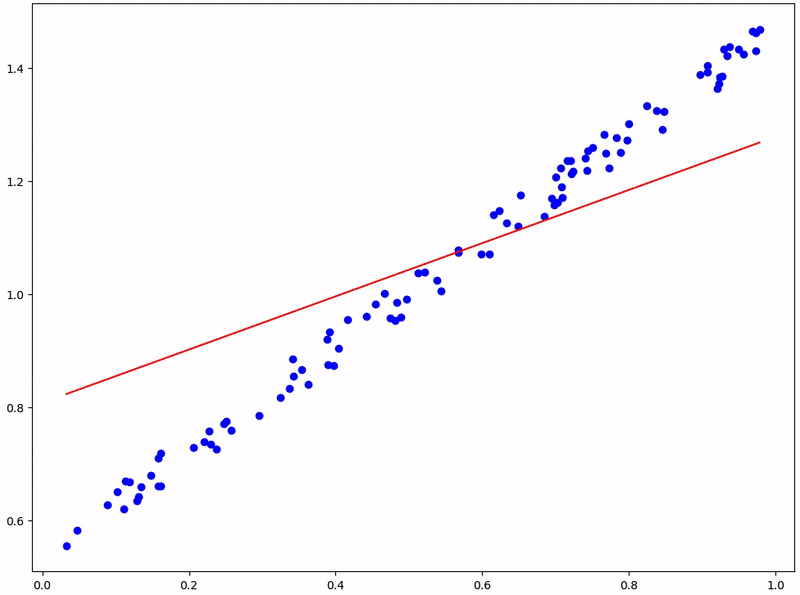

# Gradient Descent = ออโต้จูน EP. 1
=================================

<figure>
  
  <figcaption style="font-size: 0.9em;">นิ้วเกือบแตะกันอยู่แล้ว อีกนิดเดียว กระดิ๊บอีกหน่อยสิ - จากภาพ Creation of Adam ของ Michelangelo</figcaption>
</figure>

ฮายยย

ไอ้ผมก็ไปเปิด Google ดู (สมัยนี้เค้าไม่เปิดดิกกันแร้น) คำว่า gradient = ทางลาด ส่วนคำว่า descent = ขยับลง ลองรวมคำซิ gradient Descent = อิหยังวะ ?! 555 ขยับลงทางลาดเฉย เข้าใจตั้งชื่อเนาะ

ทีนี้กระพ้มจะทำออโต้จูนสิ่งต่าง ๆ ด้วยวิธีลงทางลาด 5555

Q: ทางลาดของอะไร๊

A: คืองื้นะ มันมีภูเขาของ error อยู่ลูกนึง แต่ error มันเป็นสิ่งไม่ดีไง เราเลยต้องหาทางลง ชั้นก็เลยดูรอบ ๆ ตัวดิ๊ ว่าทางไหนเป็นทางลาดลงก็ลงทางนั้นแหละ

Q: เอ้า แล้วลงไปถึงเมื่อไหร่ล่ะ

A: ง่าย ๆ เลย ลงไปให้ต่ำสุด ๆ ๆ ๆ ๆ ๆ แล้วรู้ได้ไงว่าต่ำสุดแล้ว ชั้นก็ไม่รู้หรอกแต่รอบ ๆ ตัวชั้นมันสูงกว่าหมดเลย

Q: เห็นวิวเขาโอบแน่ ๆ

A: วิวเขาโอบของ error น่ะสิ 55555 ก็ใช่ไง error ต่ำสุดก็คือดีสุด

พ้มมีโจทย์มาให้ ผมจุดเยอะ ๆ ๆ ๆ ไหนดูด้วยตาก็เห็นแนวใช่มั้ย ว่ามันเฉียง ๆ ทีนี้ลองลากเส้นตรงผ่ากลางให้ได้มากที่สุดซิ

<figure>
  
  <figcaption style="font-size: 0.9em;">จุดข้อมูลกระจายตัวที่เห็นแนวเฉียง ๆ - เตรียมลากเส้นตรงผ่านกลาง</figcaption>
</figure>

เอ้า ลาก วาง ก็ทำได้ชะ นี่มันแนวเฉียงขึ้นนนน

<figure>
  
  <figcaption style="font-size: 0.9em;">แอนิเมชั่นแสดงการลากเส้นตรงผ่านจุดข้อมูล - ลากแล้วก็ได้แนวเฉียงขึ้น</figcaption>
</figure>

แต่ถ้ามีหลายอัน เฉียงขึ้นบ้าง เฉียงลงบ้าง ก็จะเมื่อยมือเลย แล้วก็เบื่อด้วย เพราะงี้เรามาทำออโต้จูน แบบนี้ ๆ

<figure>
  
  <figcaption style="font-size: 0.9em;">แอนิเมชั่นแสดงกระบวนการ "ออโต้จูน" - AI ขีดเส้นตรงแล้วค่อย ๆ ปรับให้ได้แนวที่ถูกต้อง</figcaption>
</figure>

จะเห็นว่าทีแรก AI มันจะขีดเส้นตรงมาซักขีดนึงก่อน แล้วค่อย ๆ “ออโต้จูน” ให้ได้แนว เหมือนมือเราขีดเลย ออโตแม้ติก

บาย