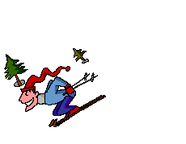
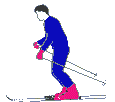
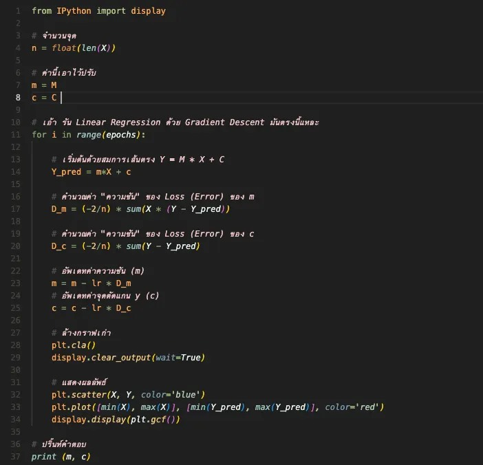
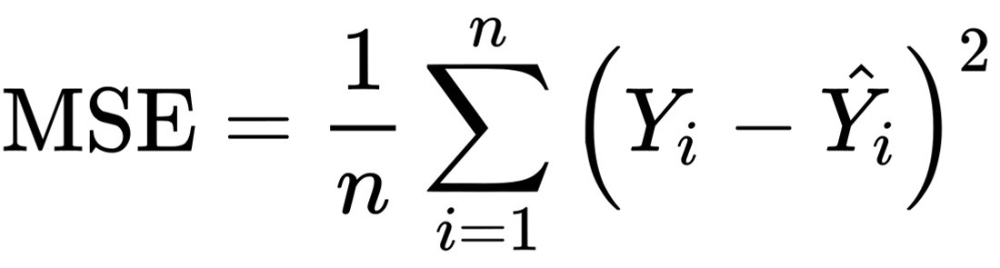
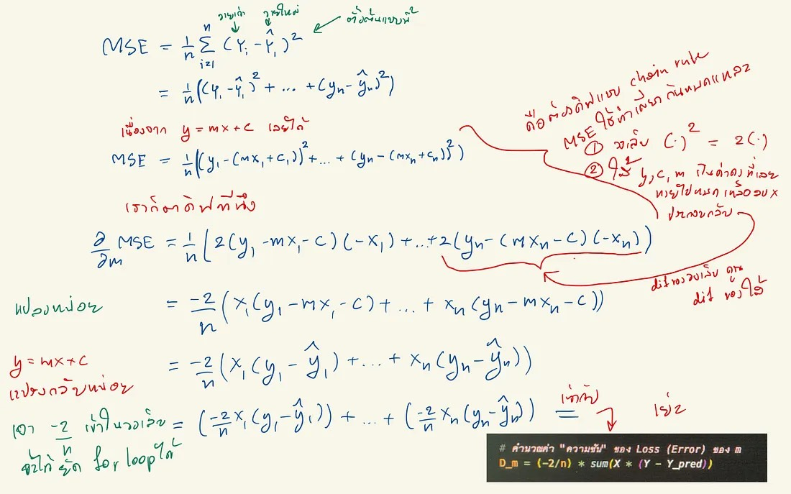

# Gradient Descent = ออโต้จูน EP. 2
=================================

<figure>
  
  <figcaption style="font-size: 0.9em;">เมื่อเริ่ม gradient descent เราจะสุ่มเจ้า AI น้อยไว้ซักที่นึง หรือจะจงใจวางไว้ที่ไหนก็ได้แต่ก็เหมือนชี้นำหน่อย ๆ</figcaption>
</figure>

<figure>
  
  <figcaption style="font-size: 0.9em;">วี๊ วู่วววว ปกติแล้วตอนเริ่มต้น ทางลงมันจะชันดิก เจ้า AI น้อยก็จะวิ่งไว แง้น</figcaption>
</figure>

<figure>
  
  <figcaption style="font-size: 0.9em;">เมื่อใกล้ ๆ ถึงหุบเขา ทางมักจะไม่ค่อยชันแล้ว เจ้า AI ก็จะค่อย ๆ วิ่งช้าลง จนหยุดในที่สุด จบ 1 เพล เย่</figcaption>
</figure>

ซึ่งจุดที่เจ้า AI น้อยมันหยุดนี่แหละ คือคำตอบที่มันให้เรา [ย้อนกลับไป EP. 1 ได้ที่นี่น้า~](ai-gradient-desent-01.md)

ฮาย มาลงลึกดีกว่า ถ้าเขียน Python เป็น ก็เอา code ไปรันได้เลย [อยู่นี่](https://github.com/prophecy/ada-garange-share/blob/master/gradient-descent/linear-regression.ipynb)

และนี่ ตัวอย่างโค้ด

<figure>
  
  <figcaption style="font-size: 0.9em;">จุดยากอยู่ที่ 2 บรรทัดที่ว่า "คำนวนค่าความชันของ Loss (Error) นิแหละ แต่เดี๋ยวอธิบายในตอนท้าย</figcaption>
</figure>

ส่วนผลลัพธ์ก็เป็นแบบนี้

<figure>
  
  <figcaption style="font-size: 0.9em;">เย่ะ ผลลัพธ์ดี ได้เส้นออโต้จูนของเราแล้ว</figcaption>
</figure>

และต่อไปนี้ ~~~~ จะอธิบายการคำนวน นะค้าบ

เพราะว่าเราใช้เส้นตรง เราก็เลยต้องใช้สมการเส้นตรง คือ

> Y = M*X + C

ส่วนวิธีการหา Error ที่เราใช้ก็คือ Mean Square Error หรือ (MSE) ซึ่งดั๊นเรียกว่า Cost (เลือกซักคำแมะ)

<figure>
  
  <figcaption style="font-size: 0.9em;">ตัวยึกยือ Σ เรียกว่าซิกม่า แทนการปั่น For loop ตรงกับบรรทัดที่ 11 ของโค้ด</figcaption>
</figure>

> D_m = (-2/n) * _sum(X * (Y — Y_pred))_

ว่าแต่ เจ้าความ D_m นี่คืออะไร และมายังไง ตอบ D_m คือความชันของ m (คิดแค่ว่า m เป็นค่าค่าหนึ่งก็พอ) แล้วจะหาความชันทำไง ตอบคือ ใช้แคลคูลัส ดิฟหนึ่งที 55555 แม่มเอ๊ย ไม่ง่ายนี่หว่า

<figure>
  
  <figcaption style="font-size: 0.9em;">จุดสำคัญ คือ ดีฟด้วย chain rule อ่ะแหละ dif ของวงเล้บ คูณด้วยดิฟของใส่ ส่วนวิธีการดิฟ ก็ธรรมดาคือเอากำลังมาคูณข้างหน้า แล้วลบตัวเองไปหนึ่ง</figcaption>
</figure>

> D_c = (-2/n) * _sum(Y — Y_pred)_

กับ c ก็ทำเหมือนกับ m นั่นแหละ แต่ว่าพวกหายไปหมดเลย ก็เลยลบง่าย 555

พอแระ จบแระ บาย