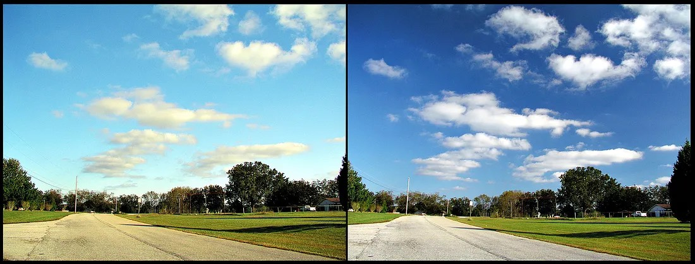
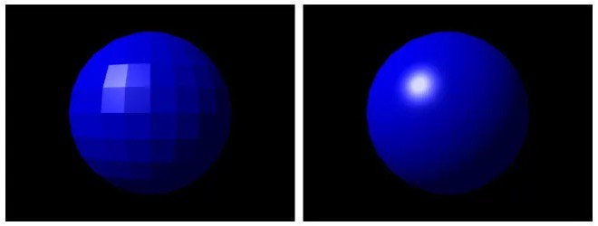

Shader programming แบบเบา ๆ
===========================

ฮาย สมมุติเราจะทำเกมหรือแอพที่ทำเอฟเฟกต์สวย ๆ ทางเลือกแรก ๆ เราก็ใช้เครื่องมือกึ่งสำเร็จรูปก่อนใช่แมะ พวก Unity 3D ซึ่งผมก็ใช้ 555 แต่ถ้าเราเขียน shader เป็น เราก็จะพลิกแพลงดัดแปลงได้ตาม เอ่อ ตามภูมิปัญญา 555

ก่อนอื่น ลองดูสามภาพนี้ก่อน จะได้เห็นแนวคิดของมัน ส่วนใครจะไปทางมโนว่าจะใช้ทำอะไรได้บ้าง หรือใครจะมุ่งไปทางสูตรคำนวน ก็ค่อยว่ากัน

<figure>
  
  <figcaption style="font-size: 0.9em;">มองซ้ายกับขวาดี ๆ มันคือภาพเดียวกันแต่ทางขวามองผ่านเลนส์โพราไรซ์ ซึ่งเจ้า shader programming ก็ทำลักษณะเดียวกัน คิดซะว่าทำฟิลเตอร์แบบแฮนเมด (https://en.wikipedia.org/wiki/Polarization_(waves)#/media/File:CircularPolarizer.jpg)</figcaption>
</figure>

<figure>
  
  <figcaption style="font-size: 0.9em;">มาดูภาพนี้ดีกว่า ทางขวาคือเขียน shader ลงไปว่าถ้าตรงไหนดูขาว ๆ ให้เปลี่ยนเป็น ขาวจั๊ว ตรงไหนไม่ขาวมากให้ถมสีรุ้ง ๆ ลงไป (https://en.wikipedia.org/wiki/Shader#/media/File:Example_of_a_Shader.png)</figcaption>
</figure>

<figure>
  
  <figcaption style="font-size: 0.9em;">แต่ในโลก 3D ของจริ๊ง ต้องมี polygons กันหน่อย ทางซ้ายเค้าใช้ท่า flat shader ที่ไม่เกลี่ยสี ก็เลยดูเหลี่ยม ๆ ทางขวาใช้ท่า phong shader ที่เอา polygons มาช่วยคำนวนเกลี่ยสี ก็เลยดูเนียน ๆ หน่อย (https://upload.wikimedia.org/wikipedia/commons/3/3d/Phong-shading-sample_%28cropped%29.jpg)</figcaption>
</figure>

ส่วนเมื่อจะทำงานกับมันนั้น จะมาทรงนี้ครัช

1.  อัพโหลด 3D Model (โครง) ขึ้น GPU
2.  อัพโหลด texture (ภาพ) ขึ้น GPU
3.  อัพโหลด shader file ขึ้น GPU
4.  จัดตำแหน่งอีกนิดหน่อย (จริง ๆ ก็ยุบยับอยู่)
5.  สั่งวาด
6.  สวย พี่สวย

จะเห็นว่า อะไร ๆ ก็ GPU ก็เพราะว่า GPU มันทำงานได้เร็วกว่า CPU ด้านภาพและ 3D (และเอองเอไอ และผองเพื่อน อิอิ) ส่วน Shader ก็เป็น Program ที่สั่งให้ GPU ทำงานนั่นแหละ

วันหลังจะมาเจาะทีละส่วน นะครับ นะครับ

อยากรู้ตรงไหนก่อน เม้นถามได้เรย

บาย~