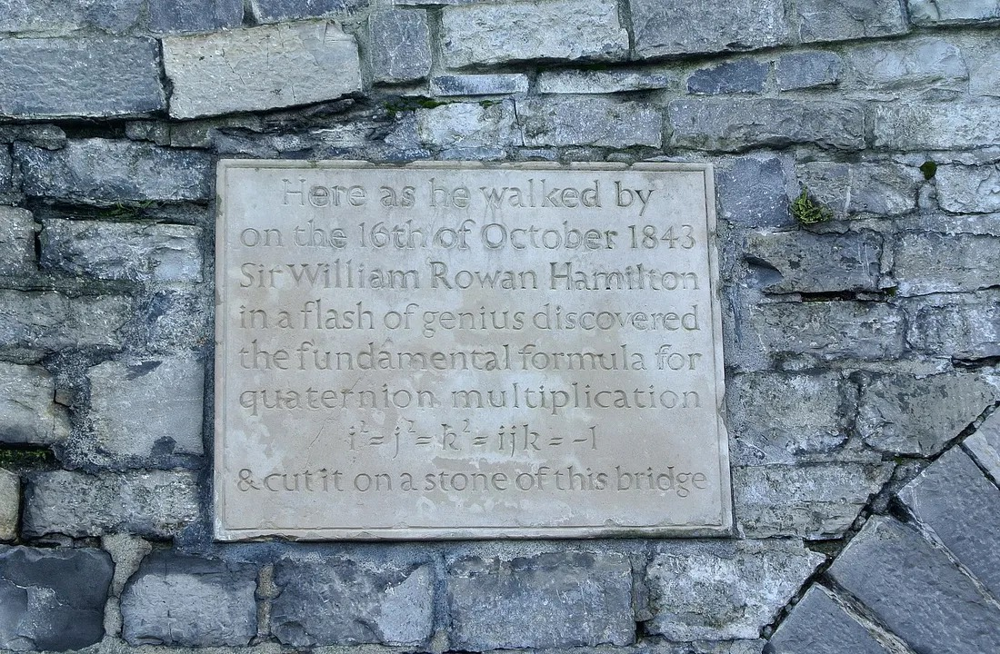
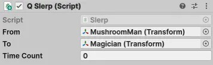
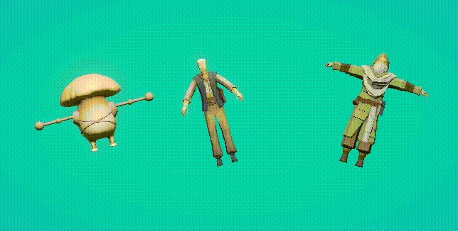
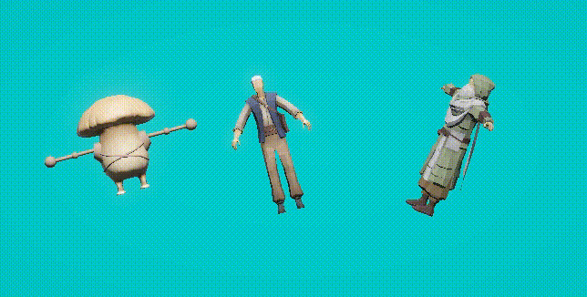

# SLERP ฉบับวนิพก พกไว้ใช้ ใช้แล้วหมุน ลื่นนนน~~



**TLDR; บทความนี้จะเอา SLERP (spherical linear interpolation) มาหมุนวัตถุสามมิติ (3D Object Rotation Problem) ซึ่งจะทำให้หมุนได้ลื่นนนนน ทุกองศาเลยครับ เขียนตัวอย่างด้วย C# Code บน Unity 3D และแจกโค้ดครับผม**

SLERP เอามาแก้ปัญหาอะไร
-----------------------

เอามาแก้ปัญหาการหมุนด้วย Euler Angle แล้วเกิด Gimbal lock อธิบายบ้าน ๆ คือ พอสั่งหมุนแล้วจะไม่สม่ำเสมอ หมุนแล้วงึก ๆ งัก ๆ เวลาขึ้นสุดลงสุด

Interpolation คืออะไร
---------------------

คือมันจะค่อย ๆ ไล่จากค่าต้นทาง ไปค่าปลายทางตาม scale ครับผม ปกติจะให้อยู่ในช่วง 0.0 ถึง 1.0 ตามนี้

```
ให้ from = 5 และ to = 100
ได้ตัวอย่างดังนี้
scale ที่ 0.0 = 5
scale ที่ 0.1 = 5 + (100-5) * 0.2 = 24
scale ที่ 0.6 = 5 + (100-5) * 0.6 = 62
scale ที่ 1.0 = 5 + (100-5) * 1.0 = 100
จริง ๆ มันก็ดูคล้าย บัญญัติไตรยางค์เนอะ
x/(100-5) = 0.2/1.0
x = (100-5) * 0.2/1.0
100-5 คือ range
ก็ต้องเอามาบวก 5 ที่เป็นค่าตั้งต้น กับตัด 1.0 ออกซะหน่อย เลยได้
x = 5 + (100-5) * 0.2
ไรงี้
```

จริง ๆ Interpolation หลายแบบ ตรง ๆ บ้าง โค้ง ๆ บ้าง แต่ไอเดียเดียวกัน ซึ่ง SLERP ก็เป็นการ interpolate เชิงมุม

ลำดับการใช้งาน
--------------

ไม่ต้องพูดพล่ามทำเพลง วิธีการใน Unity 3D มีดังนี้

1.  ปักมุมต้นทางด้วย [Transform](https://docs.unity3d.com/ScriptReference/Transform.html).rotation
2.  ปักมุมปลายทางด้วย [Transform](https://docs.unity3d.com/ScriptReference/Transform.html).rotation
3.  สั่งหมุนด้วย Quaternion.Slerp

ตัวอย่างการหมุนนนน
------------------

โค้ดจาก Unity อยู่นี่ [https://docs.unity3d.com/ScriptReference/Quaternion.Slerp.html](https://docs.unity3d.com/ScriptReference/Quaternion.Slerp.html)

อธิบายซะหน่อย

```
// ประกาศทั่วไปเมื่อใช้ Unity Script
using UnityEngine;
// ตั้งชื่อคลาสว่า QSlerp แต่ถ้าอยากตั้งชื่ออื่นก็ได้แหละ
public class QSlerp : MonoBehaviour
{
    // องศาตั้งต้น (เอามนุษย์เห็ดมาลากใส่ตรงนี้)
    public Transform from;
    // องศาปลายทาง (เอาพ่อมดมาลากใส่ตรงนี้)
    public Transform to;
    // เก็บเวลาที่จับไว้เป็นตัวแปรของคลาส มันจะค่อย ๆ เพิ่ม
    public float timeCount = 0.0f;
    // ฟังก์ชันนี้จะรันรัว ๆ
    void Update()
    {
        // บรรทัดพระเอกของเรา Quaternion.Slerp
        //     from.rotation คือองศาเริ่มต้น (ของมนุษย์เห็ด)
        //     to.rotation คือองศาปลายทาง (ของพ่อมด)
        //     timeCount ค่าจะค่อย ๆ เพิ่มขึ้นจาก 0.0 ไปเรื่อย ๆ
        //         แต่ Unity จำกัดไว้ให้ ตามหลักแล้วต้องหยุดแค่ไม่เกิน 1.0
        //         ถ้าค่าเป็น 0.0 จะมีองศาเดียวกับต้นทาง (มนุษย์เห็ด)
        //         ถ้าค่าเป็น 1.0 จะมีองศาเดียวกับปลายทาง (พ่อมด)
        //         ค่าระหว่างทาง จะค่อย ๆ ไล่ ก้ำ ๆ กึ่ง ๆ เรียกว่า interpolation
        transform.rotation = Quaternion.Slerp(from.rotation, 
                             to.rotation, 
                             timeCount);
        // ค่อย ๆ บวก timeCount ด้วย deltaTime
        timeCount = timeCount + Time.deltaTime;
    }
}
```

สำหรับ script ที่อยู่กับ Object ชาวไร่ จะต้องลาก MushroomMan (มนุษย์เห็ด) กับ Magician (พ่อมด) ตามภาพ



ลองดูผลลัพธ์กันหน่อย อันนี้แสดงให้ดูง่าย ๆ ว่าชาวไร่ จะค่อย ๆ เอนจากองศาต้นทางไปยังองศาปลายทาง



ลองทำให้ซับซ้อนขึ้นอีกนิด ลองหมุนตัวองศาปลายทาง (พ่อมด) กันหน่อยให้ตัวเอน ๆ จะเห็นว่าพี่ชาวไร่ก็จะเอน ๆ ตาม GGEZ



แต่เอ๊ะ ยังไม่ได้อธิบายปัญหา Gimbal lock ของ Euler Angles เลย อ้าววววววว ไว้ว่าง ๆ คราวหน้าจะมาเขียนต่อนะคร้าาบ

สวัสดี บัยยย ~