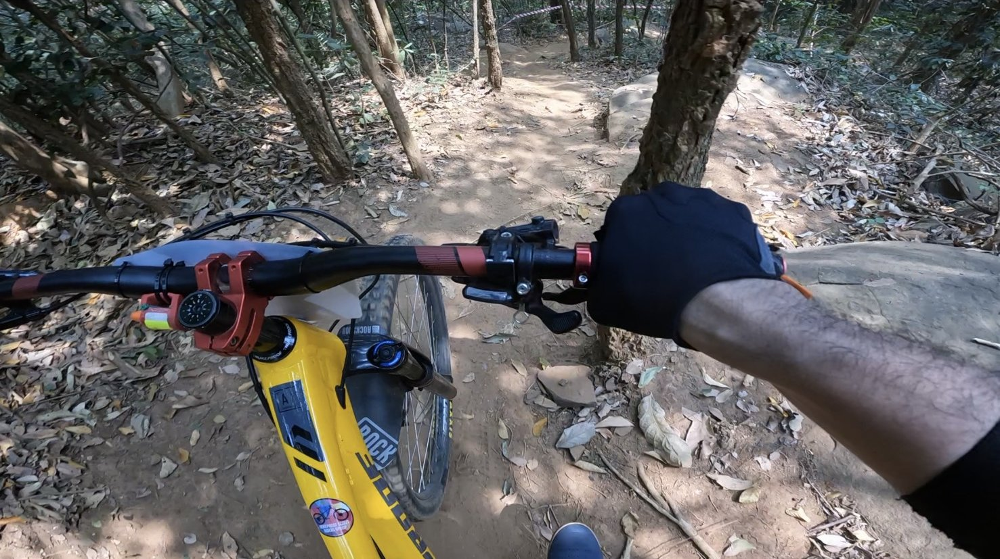
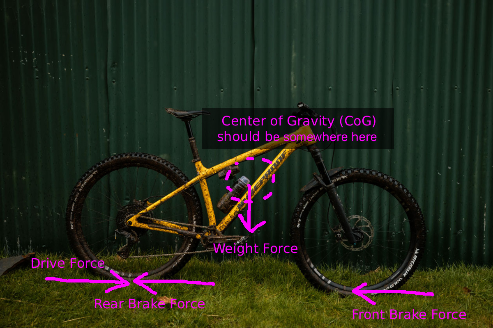

# MTB Physics Basics

<figure>
  
  <figcaption style="font-size: 0.9em;">I was on a Nukeproof Scout, my beloved hardtail mountain bike. This downhill trail section requires braking, weight transfer, and even tire pressure counts.</figcaption>
</figure>

Mountain biking on trails is not easy. With dirt, mud, roots, and stones creating complex terrain, understanding motion physics becomes essential when developing realistic simulations and games. I'll show the basic knowledge pieces before combining the building blocks. However, starting with an intuitive picture is a good place to begin.

<figure>
  
  <figcaption style="font-size: 0.9em;">The image shows a simplified overview of the key physics forces acting on a mountain bike.</figcaption>
</figure>

**CoG** = Center of Gravity  
If forces are applied at the CoG point, the bike will simply move. Otherwise, the forces will make the bike move and rotate at the same time. For example, when you apply the front brake very hard while going fast, you will go over the handlebars (OTB). Or if you pedal hard while shifting your weight back, you can lift the front wheel. Try it.

**Weight** = Gravitational force vector acting downward from the CoG point  
Weight (W) = mass (M) × gravity (G). But in practical terms, weight is what you feel because you simply step on a scale to measure it.

**Drive Force** = Forward propulsion force generated when the rider pedals  
**Front/Rear Brake Force** = Deceleration forces that are applied when the rider engages the brake levers  
For further explanation: you cannot brake harder than your tire's grip allows. More specifically, the friction between the tire and the ground is described by; **F = &mu; &times; mg**

Where:
- **F** = friction force (maximum braking force)
- **&mu;** = coefficient of friction between tire and ground
- **m** = mass of bike and rider
- **g** = gravitational acceleration (9.8 m/s²)

Then, what will happen if you brake harder than the friction force? Yes, you will skid. The skidding coefficients are normally lower than static friction coefficients. So don't let your bike skid when you don't want to.

