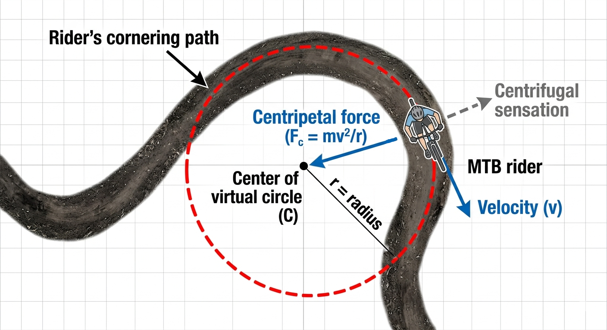

# MTB Physics - Cornering 1 - Virtual Circular Arc

<figure>
  
  <figcaption style="font-size: 0.9em;">Virtual circular arc overlaid on cornering path, illustrating the radius (r) and centripetal force direction toward the center of the turn.</figcaption>
</figure>

When analyzing cornering physics, we can visualize the rider's path as following a **virtual circular arc**. This imaginary circle helps us understand the forces at play during the turn.

By modeling the corner as a circular path, we can examine the **centripetal force** - the inward force that keeps the rider moving in a curved trajectory toward the circle's center. Without this force, the bike would continue in a straight line due to inertia.

The centripetal force required for cornering is described by:

**Fc = mv²/r**

Where:
- **Fc** = centripetal force (Newtons)
- **m** = combined mass of rider and bike (kg)  
- **v** = velocity through the turn (m/s)
- **r** = radius of the turn (meters)

This equation reveals that cornering force increases dramatically with speed (squared relationship) and decreases with larger turn radius - explaining why tighter turns at high speeds are so challenging!
