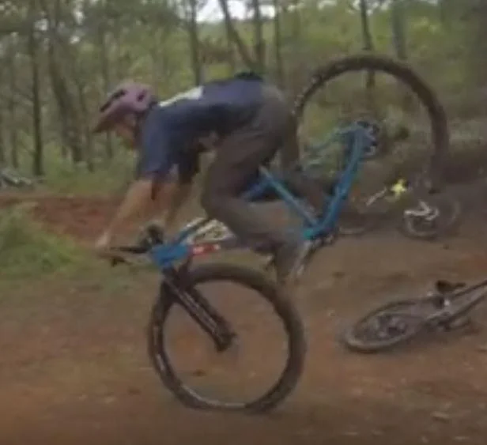
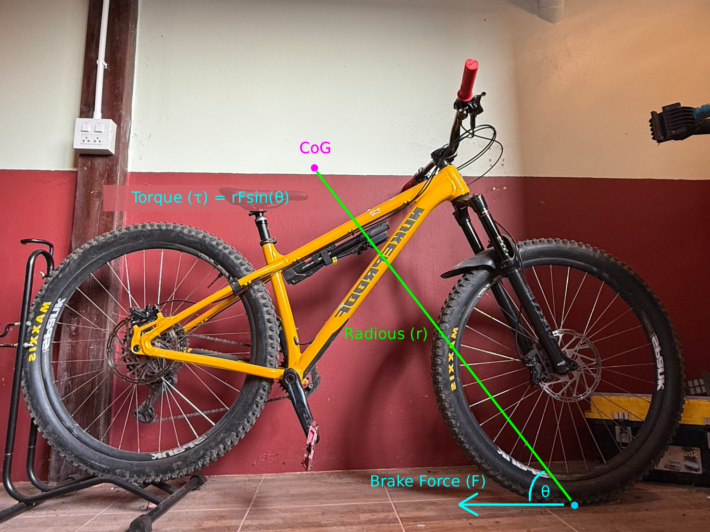

# MTB Physics - OTB and front braking

<figure>
  
  <figcaption style="font-size: 0.9em;">When you brake too much, you will get over the bar (OTB) - but how? MTB is complex, but the easiest explanation may be the front brake.</figcaption>
</figure>

If the bike is moving with **velocity (v)** and you apply the front brake (but not too strongly), the braking force is applied while still within the friction limit between the tyres and the ground described by **Fbr ≤ μ × mg**. The brake force makes the bike decelerate by **reducing forward velocity (v)**. However, since the center of mass **(CoM)** is positioned high, the front brake force also creates a rotational effect on the bike.

In the same way that linear force is described by **F = ma**, rotational force is described by torque, which is explained by **τ = r Fbr sin(θ)**

**Torque (τ)** can be thought of as "twisting strength" if it is easier for you to imagine.

<figure>
  
  <figcaption style="font-size: 0.9em;">Visual representation of how braking force creates torque around the center of mass, demonstrating the rotational effect on the bike.</figcaption>
</figure>

When you apply the front brake, the torque makes your bike rotate and makes it "pitch down" (Oh, don't brake too much or you're gonna go OTB). Then the next question is: is there any other torque to stop it? Yes, another secret torque comes from gravity.

Imagine when you brake hard at the front—you're gonna get OTB because of what? "Your rear wheel lifts." So another torque comes into play, described by **τcounter = Lmg** where **L = horizontal length between front wheel's contact point and CoM**

So your bike will stay balanced and keep it shredding!!!