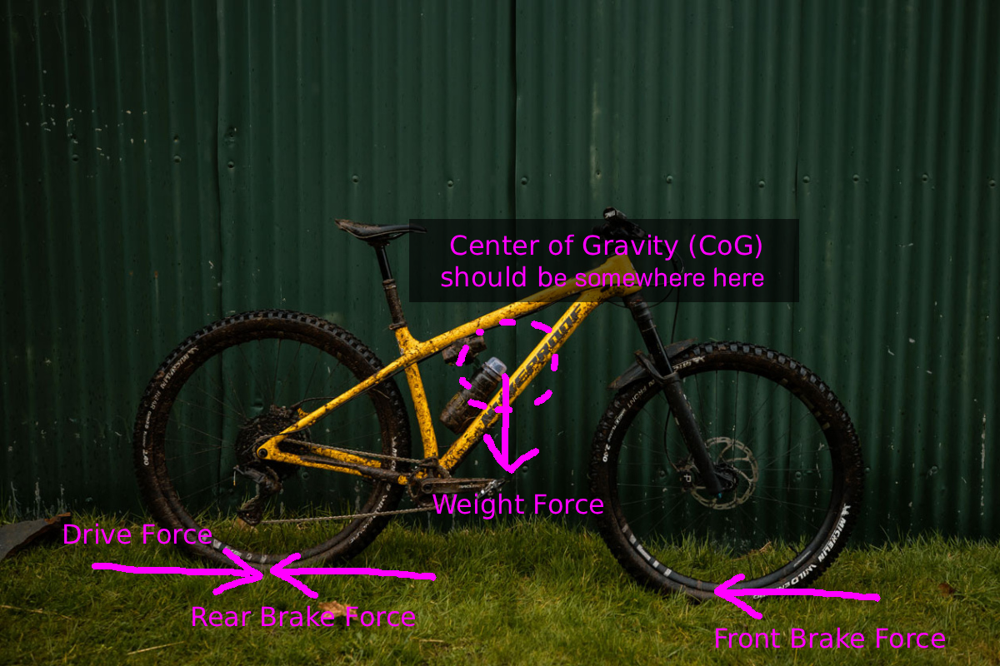

# MTB Physics - The Pitch

<figure>
  
  <figcaption style="font-size: 0.9em;">As shown in the picture, all external forces—driving and braking forces—act at the points where the tyres make contact with the ground. </figcaption>
</figure>

If the bike is moving with **velocity (v)** and you apply the front brake (but not too strongly), the braking force is applied while still within the friction limit between the tyres and the ground described by **Fbr ≤ μ × mg**. The brake force makes the bike decelerate by **reducing forward velocity (v)**. However, since the center of gravity **(CoG)** is positioned high, the front brake force also creates a rotational effect on the bike.

In the same way that linear momentum is described by **p = m × v**, rotational motion is described by torque, which is explained by **τ = r × F = r × Fbr × sin(θ)**

**Torque (τ)** can be thought of as "twisting strength" if it is easier for you to imagine.

Todo: add the image explain Torque