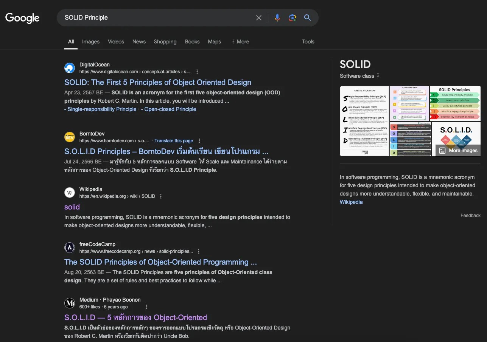
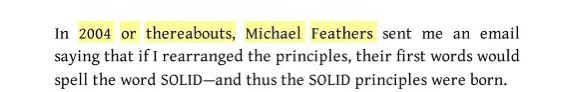

# รวมต้นฉบับเอาไว้อ่าน SOLID Principles

TLDR; อ่าน Getting Started จาก Uncle Bob ได้เลย ที่
---------------------------------------------------

[https://sites.google.com/site/unclebobconsultingllc/getting-a-solid-start](https://sites.google.com/site/unclebobconsultingllc/getting-a-solid-start)

เริ่มรวมต้นฉบับก่อนสตาร์ทจร้า~
------------------------------

เมื่อพูดถึง SOLID Principles ก็อาจคิดง่าย ๆ ว่าถ้าทำตามแล้วก็จะสามารถสร้างซอฟต์แวร์ที่ดีได้ เพราะ Uncle Bob เป็นคนคิด! และพอลองเสิร์ชใน Google ก็จะเจอบทความเต็มไปหมด แถม AI นางสรุปมาให้ ว่าใช้เพื่อใช้กับการออกแบบโปรแกรมเชิงวัตถุ (Object-Oriented Programming (OOP)) นะ ถ้าเอาหลักการ (Principles) นี้มาใช้ โค้ดเราก็จะเข้าใจง่ายขึ้น ยืดหยุ่นขึ้น และดูแลได้ง่ายขึ้น ทันใจดีจริง ๆ แต่ผมก็มีคำถามว่า

“บทความต้นฉบับอยู่ไหนนะ (น๊ะ)”

“เขียนขึ้นเมื่อไหร่” และ

“ใช้กับโค้ดผมได้ไหมเนี่ย”

**“บทความต้นฉบับอยู่ไหนนะ (น๊ะ)”**
----------------------------------

บทความต้นฉบับหายากกว่าที่คิดแฮะ เพราะจากเดิมผมคิดว่าเจ้า SOLID Principles เนี่ยคุณ Uncle Bob เป็นคนคิดขึ้นมา แต่มันซับซ้อนที่ว่าจริง ๆ แล้ว SOLID เนี่ยคุณ Michael Feathers เป็นคนเขียนตัวย่อนี้เมื่อปี 2004 โดย Uncle Bob บอกไว้ในหนังสือ Clean Architecture ของนาง

ลองไปตำหนังสือได้ที่นี่ครับ

[https://thailand.kinokuniya.com/bw/9780134494166?srsltid=AfmBOoojoWfOiFsyvcIPtdB4rvsLdnmQMnmJEZ1lRb-LBns2XNvYUiU3](https://thailand.kinokuniya.com/bw/9780134494166?srsltid=AfmBOoojoWfOiFsyvcIPtdB4rvsLdnmQMnmJEZ1lRb-LBns2XNvYUiU3)

ประหนึ่งว่าพวกนายทั้งหลาย (Software Engineer) ดู 5 ข้อนี้ดิ๊

1.  **S**ingle Responsibility ไม่อธิบาย ไปดูเอง คนอธิบายเยอะแล้ว
2.  **O**pen/Closed ไม่อธิบาย ไปดูเอง คนอธิบายเยอะแล้ว
3.  **L**iskov Substitution ไม่อธิบาย ไปดูเอง คนอธิบายเยอะแล้ว
4.  **I**nterface Segregation ไม่อธิบาย ไปดูเอง คนอธิบายเยอะแล้ว
5.  **D**ependency Inversion ไม่อธิบาย ไปดูเอง คนอธิบายเยอะแล้ว

แต่สิ่งนี้อยู่บน paper ของคุณ Uncle Bob อีกที ซึ่ง paper นางชื่อ **“Design Principles and Design Patterns”**

ดูฉบับเต็มได้ที่นี่เลย [https://labs.cs.upt.ro/labs/ip2/html/lectures/2/res/Martin-PrinciplesAndPatterns.PDF](https://labs.cs.upt.ro/labs/ip2/html/lectures/2/res/Martin-PrinciplesAndPatterns.PDF)

ซึ่งก็มีมากกว่า 5 ข้อนะ แต่ก็น่าอ่านน่าศึกษานะครับ แถมก็ไม่ได้ยาวเหยียดจนอ่านเหนื่อย

**“เขียนขึ้นเมื่อไหร่”**
------------------------

อ่านช้า ๆ นะครับ 555 เขียนปี 2000 (ณ ปีที่เขียนบทความนี้คือ 2024)

เก่าเกิ๊นนน (ในทางวิจัยแล้ว จะไม่อ้างอิงงานวิจัยที่เก่ากว่า 5 ปีนะครับ เพราะภาคคอมไปไวมาก ๆ)

ซึ่งถ้าสงสัยว่าว่า “เก่าไปไหม” ลองค้นดูก็พบว่าเราไม่ได้ถามคำถามนี้เป็นคนแรก มีคนส่งจดหมายถามเจ้าตัว Uncle Bob เองแล้วก็อธิบายตามนี้เลยครับ

[Clean Coder Blog
----------------

### Recently I received a letter from someone with a concern. It went like this: For years the knowledge of the SOLID…

blog.cleancoder.com](https://blog.cleancoder.com/uncle-bob/2020/10/18/Solid-Relevance.html?source=post_page-----225d0eca5c06---------------------------------------)

บทความนี้เขียนเมื่อ 2020.10.18 โอ้ ยังไม่เก่าเกิน 5 ปี รีบอ่านนะครับ ^_^ อิอิ

“ใช้กับโค้ดผมได้ไหมเนี่ย”
-------------------------

ผมอยากให้อ่านจากบทความต้นฉบับที่รวมไว้ให้แล้ว แล้วลองพิจารณาเองนะครับ ลองโต้แย้งกับเพื่อน ๆ พี่ ๆ ในทีมด้วยนะค้าาาบ

สวัสดี บัยยย ~